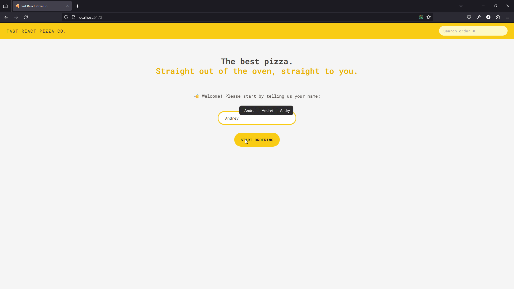

<h1 align="center">🍕Fast react pizza🍕</h1>
<h3 align="center">🛒Simple app to make orders at fictional pizza store🛒</h3>
<h3 align="center" >⚛️App was created during the Jonas Schmedtmann react course⚛️</h3>

## ▶️Demonstration:

## 🚀This app is example of:
- 🧱 How to use redux toolkit
- 🪄 How to make proper app structure
- 💅 How to use tailwind CSS
- 🛣️ How to use react routes in modern way(with cool load and write features)
- 🕝 How to use createAsyncThunk function from redux toolkit

<h3 style="background: linear-gradient(to right, #833ab4, #fd1d1d, #fcb045); -webkit-background-clip: text; -webkit-text-fill-color: transparent;" 
> View a live demo of the project here:</h3>

